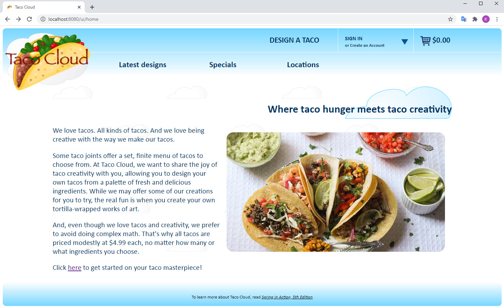
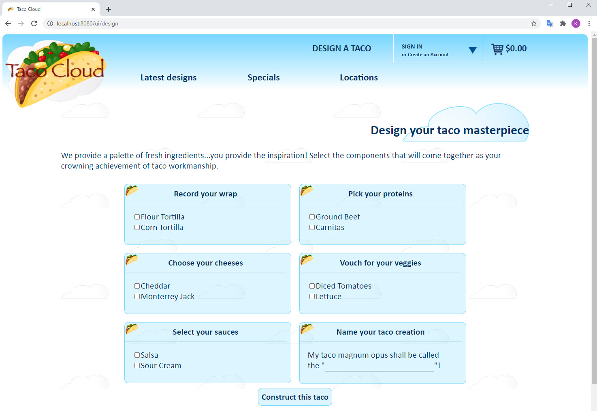

# Taco Cloud 0.0.9

This folder contains the source code for the Taco Cloud sample from Spring in Action, 5th edition, as presented in Chapter 9.

# Taco Cloud modules

The multi-module Maven project is made up of the following modules:

 - `tacocloud-api` : The REST API
 - `tacocloud-data` : The persistence module
 - `tacocloud-domain` : The domain types
 - `tacocloud-email` : The email module that demonstrates using Spring Integration to handle orders by email.
 - `tacocloud-kitchen` : An application to be run in the Taco Cloud kitchen that will receive orders for kitchen staff to prepare.
 - `tacocloud-messaging-jms` : The Taco Cloud messaging module that sends messages using JMS.
 - `tacocloud-messaging-kafka` : The Taco Cloud messaging module that sends messages using Kafka.
 - `tacocloud-messaging-rabbitmq` : The Taco Cloud messaging module that sends messages using RabbitMQ.
 - `tacocloud-restclient` : Client code that consumes the API exposed from `tacocloud-api`.
 - `tacocloud-security` : The security module (TODO: Not fully functional yet.)
 - `tacocloud-ui` : A Typescript Angular UI
 - `tacocloud-web` : The web module (largely leftovers from previous chapters. TODO: Clean up and remove.)
 - `tacos` : The main module that pulls the other modules together and provides the Spring Boot main class.

Home page example:

Design page example:
